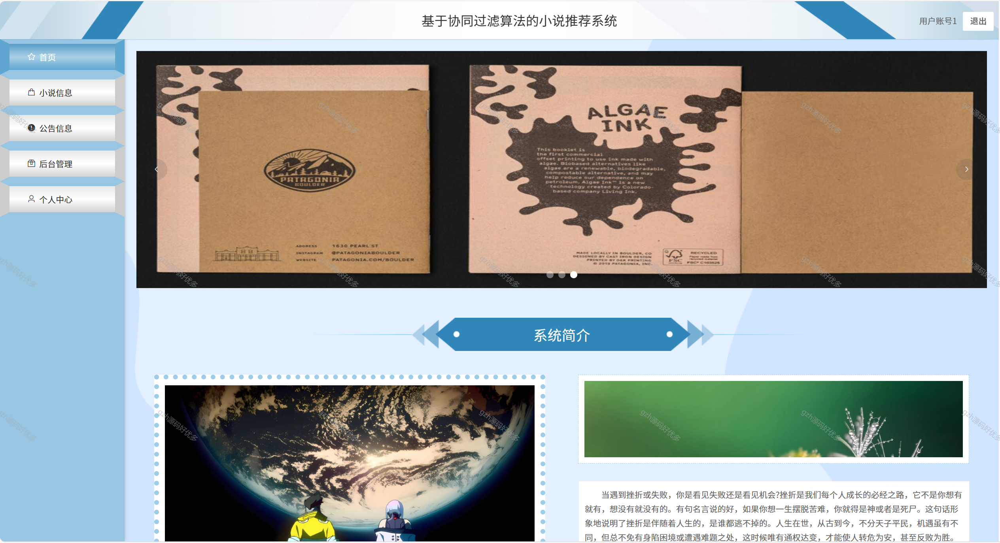
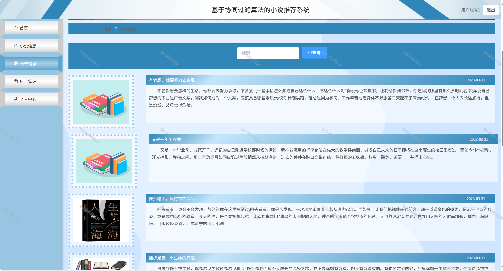
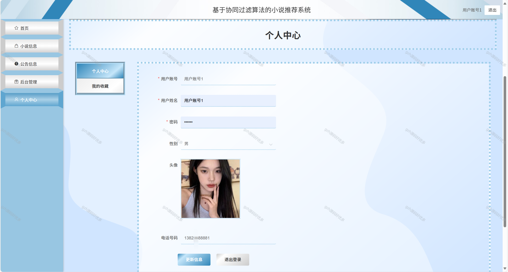
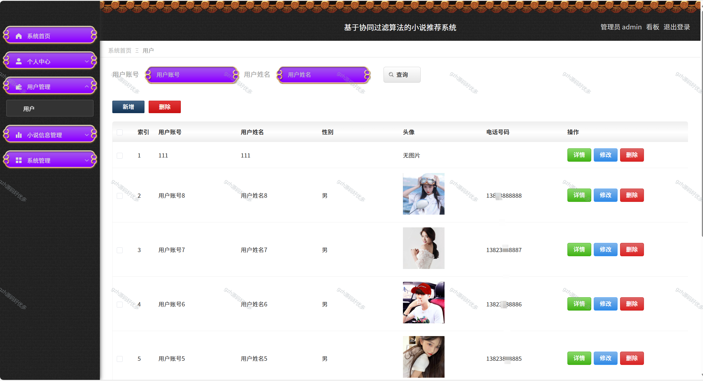
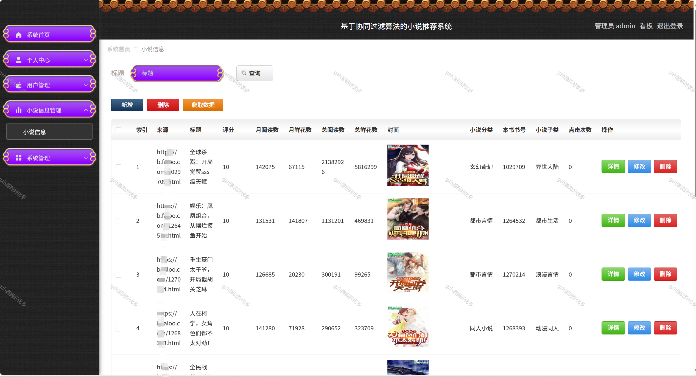
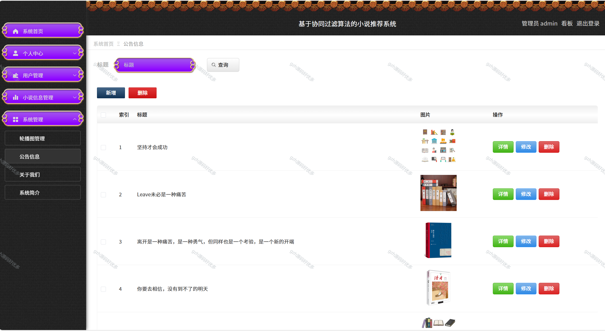
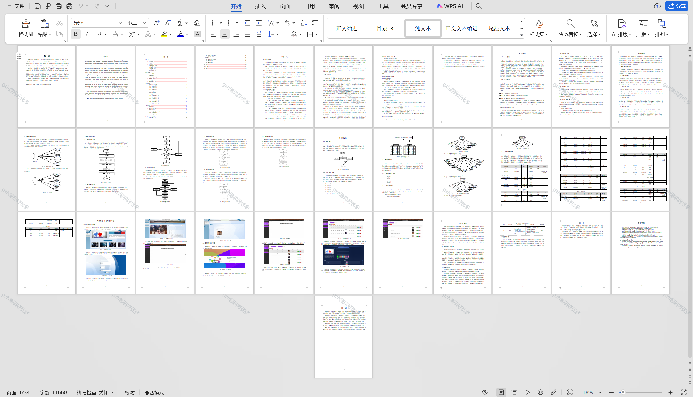

# python094
python094基于Python+Django的协同过滤算法的小说推荐系统+LW+PPT
 
## 查看主页获取源码

### 一、关键词
基于协同过滤的小说推荐系统，协同过滤型小说推荐系统，

### 二、作品包含
源码+数据库+设计文档万字+PPT+全套环境和工具资源+本地部署教程

### 三、项目技术
前端技术：Vue2.0、Element-ui
后端技术：Python3.7、Django2.0

### 四、运行环境（以下版本亲测，其他版本兼容性请自行测试）
开发工具：PyCharm + VSCODE

数据库：MySQL5.7（最低要5.7版本）

数据库管理工具：Navicat10+

Python：Python3.7

前端Nodejs：14

浏览器：谷歌浏览器

### 五、项目介绍
项目编号：python094

根据需求分析结果进行了系统的设计，网站主要功能包括对个人中心、用户管理、小说信息管理、系统管理等进行管理。使用目前市场主流的技术 Django框架构建，使用Python开发语言和MySQL数据库对系统进行高内聚低耦合的设计，最终完成了小说推荐系统的实现。
本系统为当前管理提供了一个高效、便捷、信息化的解决方案、有效管控了获取小说推荐数据的各个环节，这为后期系统的优化提供了新的方向。

### 六、运行截图

